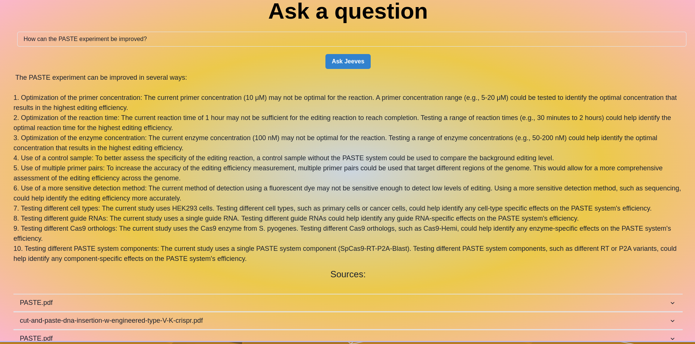

# RAGS
Upload any PDF file(s) and ask about them. Get an ELI5 about an academic research paper, red-flags in a contract, or just upload batches of textbooks and ask away! Manage multiple RAGs by adding PDFs to an existing batch, creating new batches, or removing batches.

A retrieval augmented generation system (RAGS) via langchain RecursiveCharacterTextSplitter, HuggingFaceBgeEmbeddings, and a chromaDB vector store. The default LLM is llama-2-70B-chat hosted by together.ai. 

### Get started:
_Get an API key from together.ai, and thenopen one terminal for the frontend, and another for the backend_
#### run backend:
1. `cd RAGS/llm`
2. `python -m venv rag-env`
3. `source rag-env/bin/activate`
4. `pip install requirements.txt`
5. `uvicorn main:app --reload `
#### run frontend:
6. `cd RAGS/ui`
7. `npm install`
8. `npm run dev`
